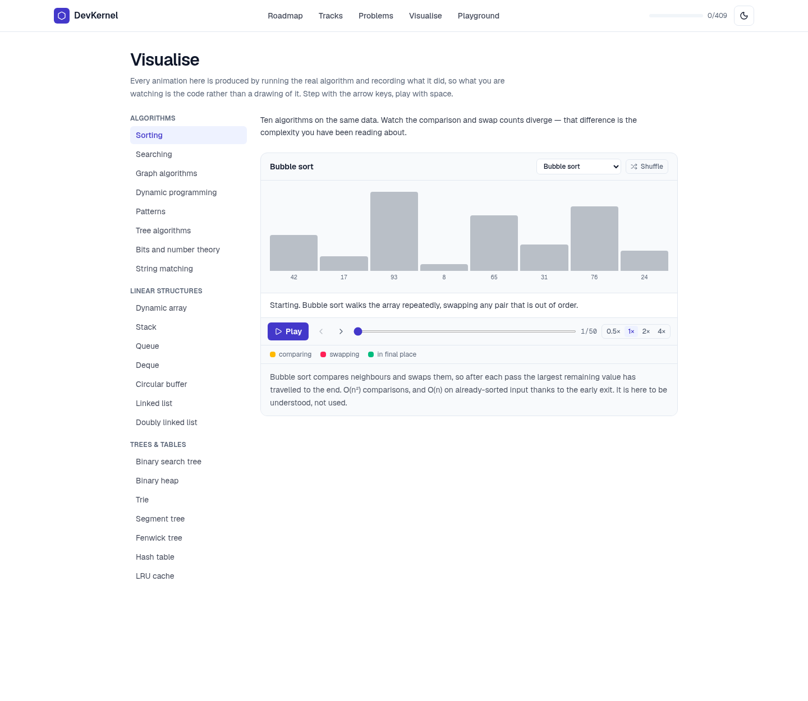

<h1>DevKernel</h1>

**A from-scratch software-engineering curriculum where every line of output on the page was produced by running the code.**


---

## Table of contents

- [Why this exists](#why-this-exists)
- [The idea, in one paragraph](#the-idea-in-one-paragraph)
- [Who it is for](#who-it-is-for)
- [What is in it](#what-is-in-it)
- [The three commitments](#the-three-commitments)
  - [1. Nothing is written from memory](#1-nothing-is-written-from-memory)
  - [2. One algorithm, seven languages](#2-one-algorithm-seven-languages)
  - [3. The pictures are generated by the algorithm](#3-the-pictures-are-generated-by-the-algorithm)
- [Screenshots](#screenshots)
- [Architecture](#architecture)
- [Running it locally](#running-it-locally)
- [The checks](#the-checks)
- [Adding a lesson](#adding-a-lesson)
- [Status](#status)

---

## Why this exists

Most programming courses fail in one of two ways, and they are opposite failures.

The first is the **tutorial that never goes deep**. It shows you `for i in range(n)` and moves on. It never tells you that integer division rounds toward zero in six languages and toward negative infinity in Python, so you will write a binary search that works on every test you try and breaks on the one with a negative midpoint. It leaves out the part that would have mattered.

The second is the **reference that assumes the floor**. It starts at arrays. It assumes you know what a variable costs, what the compiler is doing, why a string built in a loop is quadratic. People who already know those things find it excellent. Everyone else bounces off it, and concludes they are bad at this.

There is a third failure that both share, and it is the one this project was built to fix: **the output on the page is usually typed by hand**. Someone wrote the code, believed they knew what it would print, and typed that in. Most of the time they were right. The rest of the time a learner spends an hour discovering that the reference material is wrong, and they have no way of knowing which case they are in.

That last problem is tractable in a way the other two are not. You can just run the code.

## The idea, in one paragraph

Write the curriculum as data — TypeScript objects containing prose, code and the output that code produces — and then **make the build fail if the output is wrong**. Every example is compiled and executed by a real toolchain and diffed against what the lesson claims. Every visualisation is generated by running the actual algorithm rather than by drawing what someone remembers it doing. Every complexity claim is measured rather than asserted. The result is a course whose central promise — *this is what actually happens* — is enforced by CI rather than by good intentions.

## Who it is for

- **Someone who has never written a for-loop.** The DSA track opens at what a program *is*, what happens to the file you typed, and where the values live. It does not assume a language, and it does not assume you have seen a terminal.
- **Someone who has read about every algorithm and still freezes on a blank editor.** The framework module is an explicit, repeatable method for taking an unseen problem apart — the step most courses skip and the reason their graduates still stare at problems.
- **Someone who knows one language and is being asked to interview in another.** Every algorithm example in the DSA track can be read in any of seven languages, with the same output, so the algorithm is the subject and the dialect is a dropdown.
- **Someone returning to a language they used to know.** Learning a language for the first time and getting one back are different jobs. Learn tracks build up in order; revision tracks are short and standalone.

It is *not* for someone looking for a quick reference. The prose is long on purpose.

## What is in it

| | |
| --- | --- |
| Tracks | 12 |
| Lessons live | 409 (554 including published-but-unwritten syllabus) |
| Modules live | 57 of 202 |
| Code examples | 1,467 |
| Verified translations | 662 |
| Embedded visualisations | 61 |
| Prose | ~230,000 words |

**Tracks:** DSA (37 modules), C++ (14), JavaScript & TypeScript (12), Spring Boot (18), Go, Rust, React, Next.js, Angular, Java, x86-64 Assembly, System Design. Some are complete, some are in progress, and every one publishes its full syllabus up front so you can see where it goes before you start.

The DSA track is the deepest: Module 0 is programming constructs from nothing, Module 1 is data structures and algorithms with the patterns each one enables, and the later modules are recognition drills, company-wise sheets and interview technique.

## The three commitments

### 1. Nothing is written from memory

Every example in the content tree carries the output it produces. `scripts/verify-lesson-code.mjs` compiles the whole content directory, walks every lesson, extracts every example, runs it against a real toolchain, and diffs the result:

```
ok    dsa/heaps-and-priority-queues/sifting-and-building › build-heap
ok    dsa/heaps-and-priority-queues/sifting-and-building › build-heap [javascript]
ok    dsa/heaps-and-priority-queues/sifting-and-building › build-heap [rust]
...
165 examples run, 0 mismatched, 0 skipped
```

Python runs on CPython, Java through `java Main.java`, Go through `go build`, C++ through `g++ -std=c++17`, Rust through `rustc --edition 2021` — **without `-O`**, so a debug build's overflow checks are live and an underflowing `usize` panics here rather than silently wrapping in a reader's editor. Assembly is assembled with `nasm` and linked bare.

This is not a formality. It has caught, among other things:

- an example whose closing line claimed five entries went into a heap when four did;
- a `usize` subtraction that underflowed, which release mode wrapped into the right answer and debug mode panicked on;
- a C++ trace that printed its label before the function that printed the trace, because `<<` sequences left to right;
- a build-heap comparison whose measured numbers quietly contradicted the O(n log n)-versus-O(n) claim the prose was about to make.

Some outputs are environment-dependent, and that is a finding rather than an inconvenience. `Double.toString` changed in JDK 19 to emit the shortest round-tripping decimal, so an older JDK disagrees with every lesson that prints a large double. **CI pins the toolchains** for exactly this reason: a recorded output is a claim about a toolchain as much as about a program.

### 2. One algorithm, seven languages

An example may carry `alternates` — the same program in **Python, JavaScript, TypeScript, Java, C++, Rust and Go** — offered behind a dropdown. Every one of them is run by the same gate against the same expected output, so a translation that drifted is a failed build rather than something a reader discovers.

Where a language legitimately prints something different, the variant carries its own recorded output, and that difference is usually the point. Switching the language on module 1's failure example *is* the lesson:

- Python and JavaScript print three lines and then fail — neither looked at line 4 until it arrived there.
- Java, C++, Rust and Go print nothing at all — each read the whole file and refused to produce a program.
- TypeScript sits on both sides: `tsc` rejects the file outright, and it still runs under a type-stripping runner, because checking and stripping are separate steps.

The dropdown is fenced to the DSA track by a check. A C++ course's examples are C++ because that is the subject; offering to read one "in Python" would be incoherent.

### 3. The pictures are generated by the algorithm

A hand-drawn animation of merge sort is a drawing of what somebody *remembers* merge sort doing, and it will be subtly wrong in exactly the places a learner is trying to understand. So every visualisation in `lib/visuals` is an ordinary implementation with `emit()` calls threaded through it. The frames are a side effect of the algorithm actually executing.

Two gates hold this up:

- `verify:frames` runs every generator and checks the frames are well-formed — a role pinned to an index the array does not have, a spec naming an algorithm no table has, a generator that emits fewer than two frames.
- `verify:visuals` drives a real headless browser, presses Play, and measures **real elapsed time** to prove the player actually advances at each of its four speeds. It deliberately does not use `--virtual-time-budget`, because fast-forwarding `setTimeout` would fast-forward the exact mechanism under test.

## Screenshots

**Reading a lesson.** Prose, a verified example, its real output, and the language picker.


**A lesson with an embedded visualisation** — generated by running the algorithm the lesson is about.


**The visualisation gallery** — every algorithm family and data structure, steppable and reversible.



**The practice console** — write a solution, run it in the browser, have it graded against the same tests before you see anyone else's answer.


**The curriculum**, with every track's full syllabus published up front.


## Architecture

```
app/          Next.js App Router — /learn, /curriculum, /practice, /visualize, /playground
components/   Lesson rendering, code blocks, the language picker, visual canvases
content/      The curriculum, as typed data. This is the product.
  tracks/     One directory per track → per module → one file per lesson
  practice/   Problems, tests and judges
  types.ts    Lesson, Section, CodeExample, CodeVariant, VisualSpec
lib/
  visuals/    Frame generators — the real algorithms, instrumented
  judge/       In-browser grading: worker lifecycle, test comparison, verdicts
  runtimes/    Interpreters and an emulator for the compiled languages
scripts/      The verifiers
```

**Content is data, not MDX.** A lesson is a TypeScript object, which means the type checker enforces its shape, the verifiers can walk it without parsing prose, and a query like *"which examples have no translation"* is ten lines rather than a regex.

**Highlighting happens at build time.** Shiki renders every variant on the server and hands the picker finished markup, so switching language is a re-parent — no highlighter in the browser, no network round-trip.

**Code runs in the browser.** JavaScript and TypeScript execute in a Web Worker sandbox; Python runs on a CPython build compiled to WebAssembly (Pyodide); everything else — C, C++, Go, Java, Rust, x86-64 assembly — goes through interpreters and an emulator in `lib/runtimes`, loaded on demand so the initial bundle stays small. Nothing is sent to a server to be executed.

**Stack:** Next.js 16 (App Router, React 19), Tailwind 4, Shiki, Monaco, Pyodide. No database, no backend — the curriculum is static and progress lives in the browser.

## Running it locally

Requires Node 20+.

```bash
npm install
npm run dev          # http://localhost:3000
```

`predev` copies the Pyodide and Monaco assets into `public/`, so the first run takes a moment longer.

To build and serve the production bundle:

```bash
npm run build
npm start
```

## The checks

Four gates, documented so that the two people skip are the two that catch the most.

| Command | What it proves | Needs |
| --- | --- | --- |
| `npm run verify` | Types, lint, and every visualisation's frames — a few seconds | node |
| `npm run build` | Every page renders | node |
| `npm run verify:code` | Every example *and every translation* prints what the lesson says | JDK 25, Python 3.13, Go 1.24, g++, rustc, nasm |
| `npm run verify:visuals` | The player actually advances, at each of its four speeds | a running server and Chromium |

`npm run verify:code` takes an optional track and module — `npm run verify:code -- dsa arrays-and-strings` — which is how to use it while writing. `verify:visuals` needs the site already up and measures real elapsed time, so it takes a few minutes by design.

CI runs the fast half on every push and the ~900-program half beside it. To run the fast gates before every commit:

```bash
git config core.hooksPath .githooks
```

## Adding a lesson

1. Write the lesson object in `content/tracks/<track>/modules/<module>/lesson-N-<slug>.ts` and register it in the module's `index.ts`.
2. Write each example's code, **run it**, and paste the output from that run. Never type what you expect.
3. `npm run verify:code -- <track> <module>` until it is green.
4. If the example carries translations, write each one, run it, and diff it against the primary before adding it to `alternates`.
5. `npm run verify && npm run build`.

The rule that matters is step 2. If a claim cannot be verified, omit it or mark it clearly as unverified — do not assert it.

## Status

The DSA track is the furthest along: 25 of 37 modules are live, with the rest published as syllabus. C++ and JavaScript/TypeScript are complete; Spring Boot, Go, Rust, React and Assembly are in progress; Next.js, Angular, Java and System Design are syllabus-only so far.

Work in flight is the language-agnostic pass over the DSA track — making every example readable in all seven languages, so a reader arriving to solve in Rust or Go is not told in a module title that the choice was made for them.
