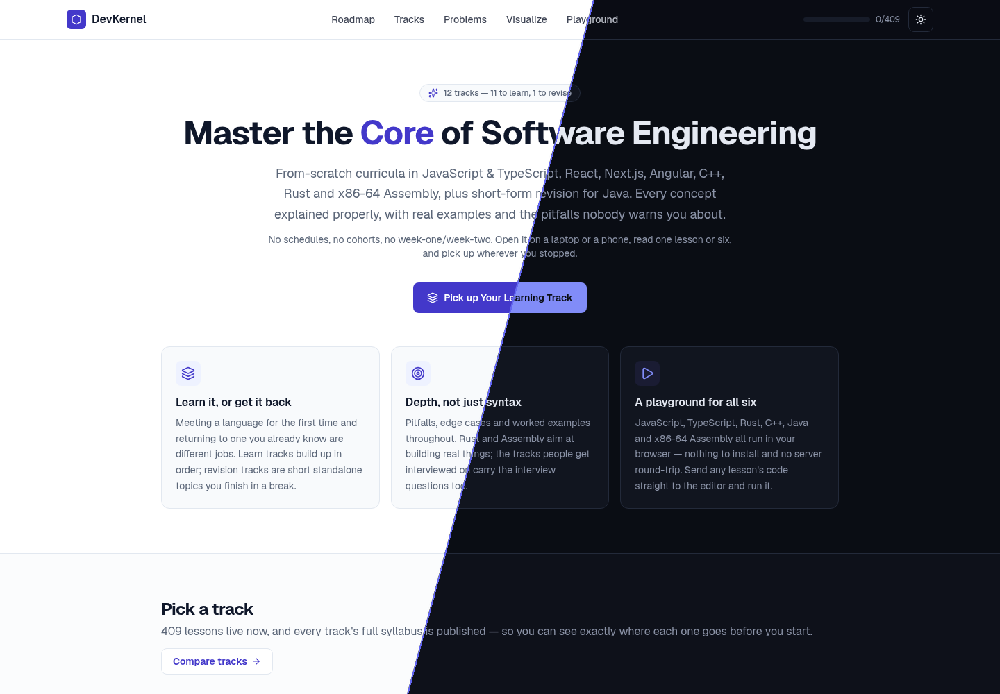
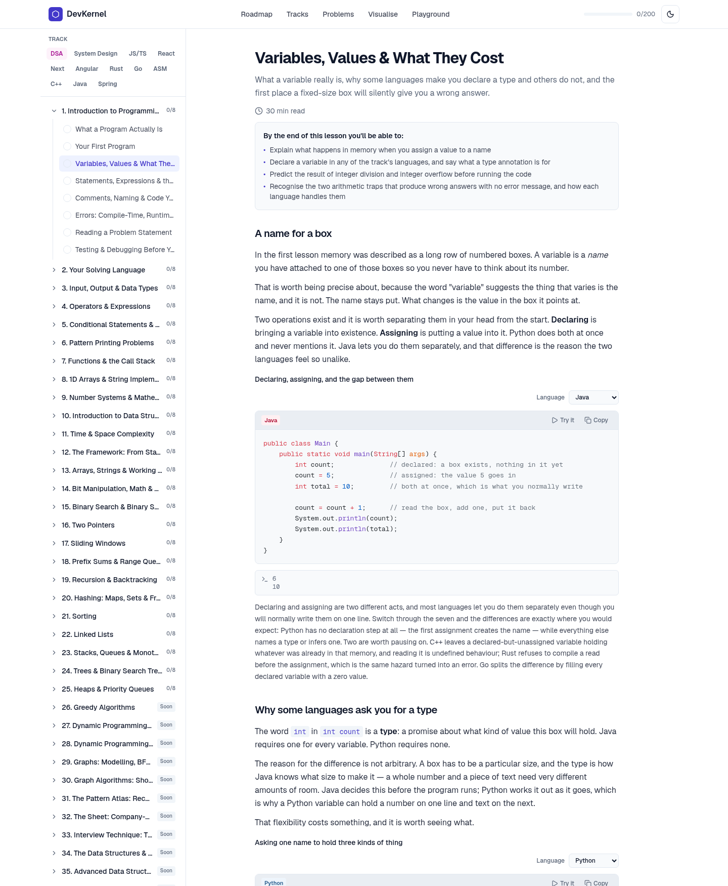
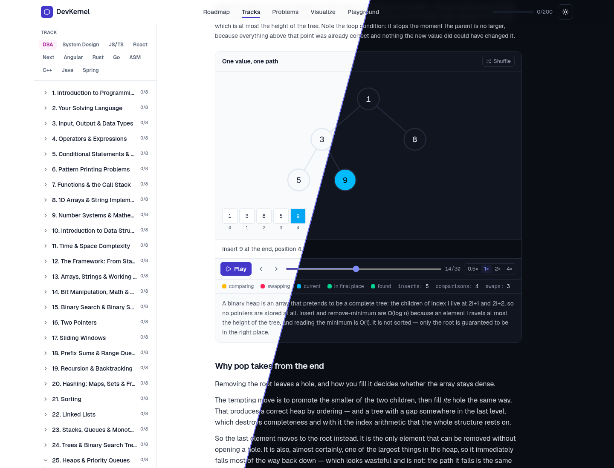
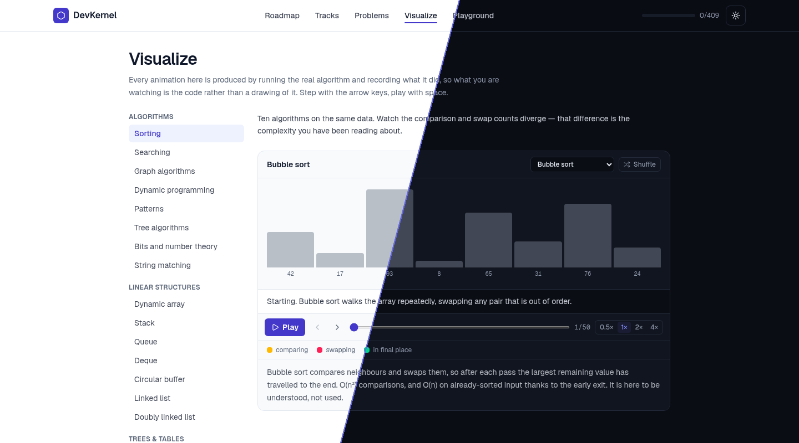
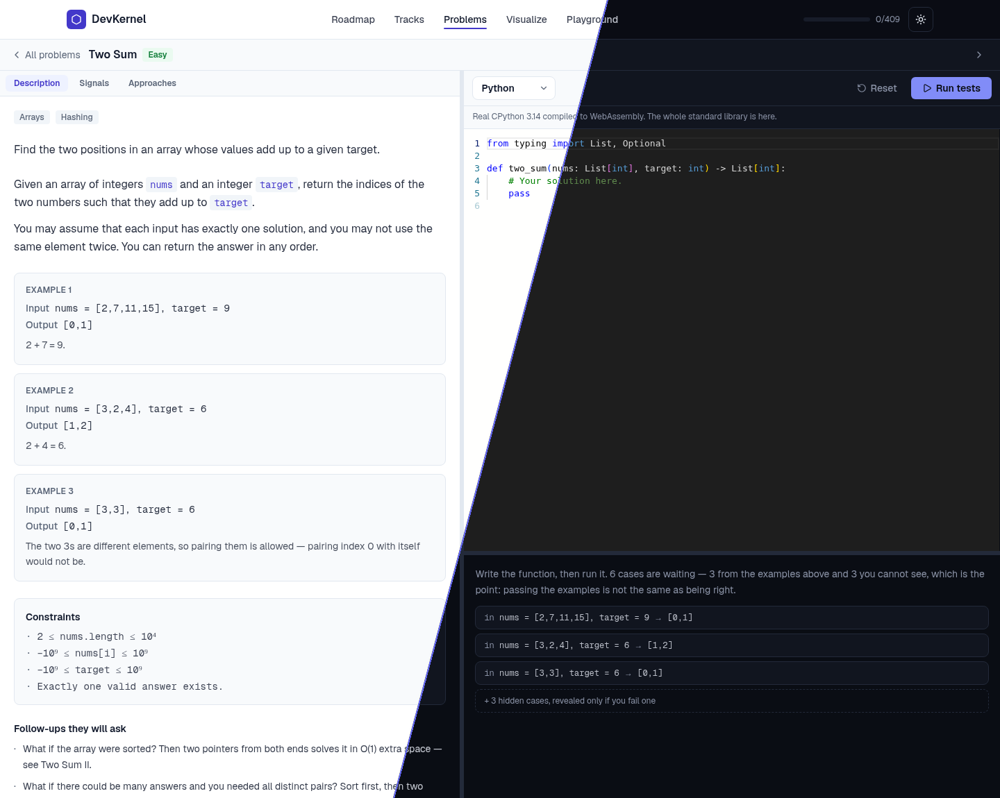
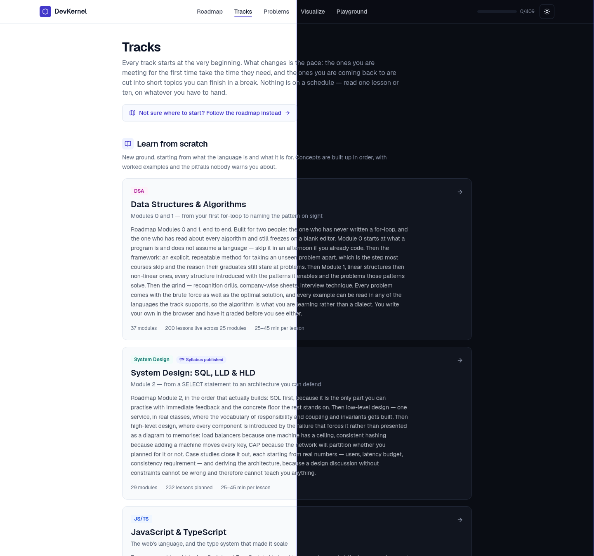

# DevKernel

A software-engineering curriculum where every line of output printed in a lesson was produced by running the code, and every animation was produced by running the algorithm.

Live at [devkernel.vercel.app](https://devkernel.vercel.app)



Every screenshot in this file is one page cut on a diagonal: light theme on the left, dark theme on the right.

## Table of contents

- [What this is](#what-this-is)
- [The central rule](#the-central-rule)
- [Features](#features)
- [How it works](#how-it-works)
- [What is in the curriculum](#what-is-in-the-curriculum)
- [Requirements](#requirements)
- [Installation](#installation)
- [npm scripts](#npm-scripts)
- [Environment variables](#environment-variables)
- [Project layout](#project-layout)
- [Deployment](#deployment)
- [Screenshots](#screenshots)
- [Contributing](#contributing)
- [Further reading](#further-reading)
- [License](#license)

## What this is

DevKernel is a Next.js 16 application, using the App Router, that serves a hand-written curriculum in software engineering together with three interactive tools. All four parts are static at build time and everything interactive runs in the visitor's browser. There is no execution backend, no database and no user accounts.

The four parts are:

- Lessons. Long-form prose with worked examples, pitfall callouts, takeaways and interview questions.
- A playground. An editor that runs nine languages in the browser with no server round-trip.
- A practice console. Problems solved in eight languages and graded against real test cases.
- A visualisation gallery. Algorithms and data structures you can step through forwards and backwards.

The curriculum is not Markdown files. It is TypeScript data: objects that hold the prose, the code, and the output that code produces. That is what makes the central rule below mechanically enforceable rather than a matter of care.

## The central rule

Nothing that claims to be a program's output is written by hand.

A learner who types an example in and gets something different from what the page promised cannot tell whether they made the mistake or the page did. The second time it happens they stop trusting the whole track. So the promise is checked by machine:

- `scripts/verify-lesson-code.mjs` compiles and runs every example in the content tree against a real toolchain, and diffs what it printed against what the lesson claims. A mismatch fails the build.
- `scripts/verify-visual-frames.ts` runs every visualisation generator and checks that the frames are well formed and that every lesson's visual specification names an algorithm that exists.
- `scripts/verify-content-ids.ts` checks that no two tracks, modules or lessons share an id. Nothing keys on a lesson id today, which is exactly why five duplicates had accumulated unnoticed; the first feature that does key on one would have conflated two lessons with no way to tell which was meant.
- `scripts/verify-visual-playback.mjs` drives a real browser and confirms the animation actually advances, which no assertion about data can establish.

The same rule governs translations. When an example offers itself in another language behind a dropdown, that translation is compiled and run too, and checked against the same expected output. An unverified translation would make the dropdown a promise nothing keeps.

## Features

Lessons

- Server-rendered prose from typed content objects, with a deliberately small inline markup dialect supporting bold, italic and inline code, and no raw HTML.
- Syntax highlighting by Shiki, done entirely on the server. No highlighter is shipped to the browser.
- A language dropdown on examples that carry translations. The choice is stored globally, so picking one language carries across every example on the page and into the next lesson.
- Embedded visualisations, pitfall callouts, per-lesson interview questions, and lesson completion tracked in the browser.
- Every track publishes its full syllabus in advance. A module nobody has written yet still declares its topics and renders as a preview rather than being hidden.

Playground

- Nine languages: C, C++, Go, Java, JavaScript, Python, Rust, TypeScript, and x86-64 assembly.
- JavaScript and TypeScript execute as real JavaScript in a Web Worker. TypeScript is type-stripped in the browser, and JSX is compiled against a small React-compatible shim the sandbox provides.
- Python is real CPython, the Pyodide build compiled to WebAssembly, so the standard library behaves as it does on a machine.
- C, C++, Go, Java and Rust run on tree-walking interpreters written for this project. x86-64 assembly runs on an assembler and emulator written for this project.
- Any lesson code block can be sent straight to the playground.

Practice console

- Eight languages: Python, JavaScript, TypeScript, Java, C++, C, Go and Rust.
- Each problem carries its signature, its visible example cases and hidden cases, and a comparison mode.
- Your attempt runs against those cases in the browser. Whether an answer is correct is decided in exactly one place, in TypeScript, so correct means the same thing in every language.
- Drafts are kept per problem and per language, so switching the dropdown does not discard what you had.
- Each problem carries a chain of approaches from brute force to optimal, in Java and Python, plus the signals in the statement that tell you which pattern it is.

Visualisations

- Generators are ordinary implementations of the algorithm with frame emission threaded through them. Delete the emission calls and a correct algorithm remains.
- A frame is a complete snapshot rather than a delta, which is what makes stepping backwards possible.
- Eight frame shapes cover arrays, heaps, trees, sequences, buckets, graphs, matrices and directory listings.

Site-wide

Dashboard

- An admin-style page at `/dashboard`, in four sections behind a sidebar: Overview, Tracks, Modules and Practice. The section lives in the URL fragment, so a view can be linked to and Back returns to the previous one.
- Overview leads with a hero figure and a meter, four stat tiles, a stacked bar splitting your completed lessons across tracks, and the next unfinished lesson in the track you are furthest through. Tracks is a sortable, filterable table of all twelve. Modules is one square per module across the curriculum, shaded by how much of it is done. Practice covers the problem set by difficulty and by topic.
- Every figure derives from what you have marked complete, and nothing is inferred. `localStorage` records *which* lessons and problems are done and not *when*, so there is no activity feed and no "continue where you left off" — the link is labelled "next unfinished", which is what it computes.
- Charts follow one rule the site's own palette forces: the twelve track colours are brand identities, not a validated categorical palette (C++ against React measures ΔE 4.7 for normal vision), so no figure distinguishes tracks by colour alone. Every bar, segment and cell is labelled in place or sits in a labelled row. The module heatmap uses a single-hue ramp, because its job is magnitude rather than identity.
- Every number is reachable without a mouse: each bar and square is a button whose tooltip opens on focus as well as hover, wired with `aria-describedby` and dismissible with Escape.
- Below `lg` the sidebar becomes a drawer with a focus trap, a scroll lock and Escape to close, and a scrollable tab row covers the same sections. Tables drop columns into the row rather than into a horizontal scroller.

- Light and dark themes with a system default, per-track accent colours, and a route-matched loading skeleton for every page. Every surface follows the theme, including the dashboard's sidebar.
- One container ladder, `page-shell` and `page-shell-wide` in `app/globals.css`, rather than a max-width chosen per page. Pages used to stop at 896px, so a 2560px monitor showed 35% content and 65% empty; they now grow in steps to 1600px and 1920px, and the card lists on Tracks and Problems go to two columns once there is room. Prose does not grow with them — each page's intro keeps its own `max-w-2xl` and a lesson body its `max-w-3xl`, because a 1600px line is not a readable one.
- Checked in a real browser at 320, 360, 390, 414, 640, 768, 834, 1024, 1280, 1440, 1920 and 2560 across every route: nothing overflows its container at any of them.
- Optional analytics through PostHog, proxied same-origin, off entirely when no key is set.

## How it works

At build time, the content tree is walked and every route is pre-rendered: one page per lesson, per track, and per practice problem. Routes are enumerated by `generateStaticParams`, and unknown parameters are refused rather than rendered.

Anything expensive and knowable in advance happens on the server. Shiki highlights every code block, including every translation of every example, and the finished markup is handed to the client. The client components that remain are small: a language picker that re-parents markup already rendered, a visualisation player that steps an index through a precomputed frame array, a sidebar that tracks which module is open, and the two editors.

Anything a visitor types runs in the visitor's browser. That is a security posture, because no untrusted code reaches a server; a cost posture, because the site is static hosting; and the constraint that produced the interpreters in `lib/runtimes`, since a browser tab cannot host rustc, g++ or a JVM.

Progress, drafts and preferences live in `localStorage`. There are no accounts, so there is nothing to sign in to and nothing to lose.

`INTERNALS.md` documents all of this in depth.

## What is in the curriculum

The figures below are counted from the content tree.

| Metric | Count |
| --- | --- |
| Tracks | 12 |
| Modules | 72 live of 203 declared |
| Lessons live | 526 |
| Lessons plus published syllabus topics | 1,543 |
| Sections | 2,344 |
| Code examples | 1,776 |
| Verified translations | 1,083 |
| Embedded visualisations | 67 |
| Pitfall callouts | 1,074 |
| Interview questions | 1,850 |
| Practice problems | 18, with 116 test cases and 40 approaches |

The tracks, with live modules against declared modules:

| Track | Slug | Mode | Modules | Lessons live |
| --- | --- | --- | --- | --- |
| Data Structures and Algorithms | `dsa` | learn | 26 / 37 | 208 |
| System Design | `system-design` | learn | 0 / 29 | 0 |
| JavaScript and TypeScript | `js-ts` | learn | 12 / 12 | 73 |
| React | `react` | learn | 15 / 15 | 115 |
| Next.js | `nextjs` | learn | 0 / 14 | 0 |
| Angular | `angular` | learn | 0 / 14 | 0 |
| Rust | `rust` | learn | 1 / 14 | 6 |
| Go | `go` | learn | 1 / 10 | 6 |
| x86-64 Assembly | `assembly` | learn | 1 / 14 | 5 |
| C++ | `cpp` | learn | 14 / 14 | 98 |
| Java | `java` | revise | 0 / 12 | 0 |
| Spring Boot | `spring-boot` | learn | 2 / 18 | 15 |

A module with no lessons written yet contributes one preview lesson that lists the topics it will cover. Those preview lessons are counted separately above and are never counted as live.

## Requirements

- Node.js 20 and npm. Continuous integration runs on Node 20; there is no `engines` field, so newer versions are untested rather than blocked.
- Disk: `node_modules` measures about 1.3 GB installed, and the two runtime payloads copied into `public/` add 35 MB, 13 MB for Pyodide and 22 MB for Monaco.

The full lesson-code verifier additionally needs the toolchains it runs examples against: a JDK, Python 3, Go, g++, rustc, and NASM with a linker. You do not need any of them to run the site, only to run `npm run verify:code` locally. Continuous integration installs them.

## Installation

```
git clone git@github.com:prajwalkamble/DevKernel.git
cd DevKernel
npm install
npm run dev
```

The site is then at http://localhost:3000.

`npm install` is the only setup step. The Pyodide and Monaco payloads are not committed to the repository; `predev` and `prebuild` copy them out of `node_modules` into `public/` automatically, so a fresh clone works without a separate command. To do it by hand, run `npm run assets`.

For a production build:

```
npm run build
npm start
```

Before pushing, run the fast gates:

```
npm run verify
```

That runs Next.js type generation, `tsc --noEmit`, ESLint, and the visualisation frame checker. It takes a couple of minutes. The slow gate, `npm run verify:code`, compiles and runs every example in the content tree and takes around ten minutes with every toolchain installed; it runs in continuous integration on every push.

`CONTRIBUTING.md` covers the branch, commit, pull and push workflow, and what is expected of a content change.

## npm scripts

| Script | What it does |
| --- | --- |
| `npm run dev` | Development server. Copies the runtime assets first. |
| `npm run build` | Production build. Copies the runtime assets first. |
| `npm start` | Serves a build produced by `npm run build`. |
| `npm run lint` | ESLint. |
| `npm run verify` | Type generation, `tsc --noEmit`, ESLint, the track manifest check, the id check, and the frame checker. The pre-commit gate. |
| `npm run manifest` | Regenerates `content/tracks/manifest.generated.ts` from the curriculum. Run it after changing content. |
| `npm run verify:manifest` | Fails when that manifest and the curriculum disagree. |
| `npm run verify:ids` | Fails when two tracks, modules or lessons claim the same id, or two sections or examples do inside one parent. |
| `npm run verify:prose` | Fails when a lesson string's inline markup would not render as written — an unclosed code span, or asterisks that pair across unrelated words. |
| `npm run verify:frames` | Runs every visualisation generator and checks the frames. |
| `npm run verify:code` | Compiles and runs every lesson example. Accepts an optional track and module to narrow it. |
| `npm run verify:visuals` | Drives a real browser and checks that playback advances. Needs a server already running. |
| `npm run assets` | Copies Pyodide and Monaco into `public/`. Implied by `dev` and `build`. |
| `npm run pyodide` | Copies Pyodide only. |
| `npm run monaco` | Copies Monaco only. |

Two development helpers are not wired to scripts and are run directly:

```
node scripts/try-runtime.mjs <rust|cpp|java|c|go> <file|->
node scripts/try-judge.mjs <problem-slug> <language> <file>
```

The first runs a source file through one of the browser language runtimes from Node. The second grades a solution file against a problem's real test cases through the same path the browser uses.

## Environment variables

Analytics is opt-in per environment. With no key set, PostHog never initialises and nothing is sent, which is what a local checkout, continuous integration and a fork should all do. Copy `.env.example` to `.env.local` only if you want your own browsing to be recorded in your own project.

| Variable | Purpose |
| --- | --- |
| `NEXT_PUBLIC_POSTHOG_KEY` | PostHog project API key. A write-only ingest key, meant to ship to the browser, granting no read access. |
| `NEXT_PUBLIC_POSTHOG_HOST` | Ingest host for your region. Defaults to `https://us.i.posthog.com`. |
| `NEXT_PUBLIC_POSTHOG_DEV` | Set to `1` to send events from `next dev` too. Off by default even with a key set. |

All three are `NEXT_PUBLIC_`, so `next build` inlines them into the client bundle rather than reading them at runtime. They must be present in the environment that runs the production build, not merely on the server that serves it.

A key on its own turns analytics on for a production build only. Development is silent unless `NEXT_PUBLIC_POSTHOG_DEV=1` is also set, because a dev machine is often on a flaky network or offline — and a send that cannot reach PostHog prints a page of connection errors per pageview — while the events that do arrive are indistinguishable from a real reader's and skew the data.

Analytics requests go out same-origin through `/ingest` and are proxied to PostHog by rewrites in `next.config.ts`. The rewrites are gated on the same condition, so a checkout with analytics off has no proxy mounted rather than an open one nothing is expected to use. Session replay blocks the Monaco editors, so nothing anyone types into the playground or the practice console is recorded.

## Project layout

```
app/          Routes. One directory per URL segment, plus a loading skeleton per route.
components/   React components, grouped by the area of the site they serve.
content/      The curriculum and the problem sheet, as typed TypeScript data.
              `tracks/` is the full tree; `tracks/meta.ts` is the same tree without
              lesson bodies, which is what every page but the lesson route imports.
lib/          Everything that is not a component: runtimes, the judge, visualisation
              generators, and the small client-side state modules.
scripts/      The verification gates, the asset copiers, and two development helpers.
public/judge/ The hand-written worker and harness files the practice console loads by URL.
docs/         Screenshots used by this file.
```

The interesting boundaries in this codebase do not line up with directories. The practice console alone spans `content/practice`, `lib/judge`, `lib/runtimes`, `public/judge` and `components/practice`. `INTERNALS.md` is organised by subsystem for that reason.

## Deployment

The site is deployed on Vercel from the `main` branch. Because every route is pre-rendered and nothing executes on a server, any static host would serve it, with two caveats: the `/ingest` rewrite in `next.config.ts` needs a host that can proxy, and the Pyodide and Monaco payloads have to be present in `public/`, which the `prebuild` step handles.

Continuous integration is a GitHub Actions workflow, `.github/workflows/verify.yml`, split in two jobs deliberately. `checks` is the fast half: types, lint, frames and a production build, finishing in a couple of minutes. `lesson-code` is the slow half: it compiles and runs every example and every translation in seven languages. Both run on every push and every pull request.

## Screenshots

The lesson page, with a code example and its verified output.



A visualisation embedded in a lesson.



The visualisation gallery.



The practice console.



The curriculum, with every track's syllabus published up front.



## Contributing

See [CONTRIBUTING.md](CONTRIBUTING.md) for the development setup, the git workflow, and what a content or code change is expected to do before it can be merged.

## Further reading

- [INTERNALS.md](INTERNALS.md). The in-depth documentation: the content data model, the three execution engines, the interpreters, the judge protocol, the visualisation frame contract, client state, and every verification gate.
- [CHANGELOG.md](CHANGELOG.md). What changed in each tagged release, with the counts measured against the tree that was released.
- `AGENTS.md` and `CLAUDE.md`. Notes for coding agents working in this repository. The Next.js block in `AGENTS.md` is written and re-added by `next dev` itself.

## License

Licensed under either of

- Apache License, Version 2.0, in [LICENSE-APACHE](LICENSE-APACHE) or at https://www.apache.org/licenses/LICENSE-2.0
- MIT license, in [LICENSE-MIT](LICENSE-MIT) or at https://opensource.org/licenses/MIT

at your option. In SPDX terms, `MIT OR Apache-2.0`.

You do not need both. Take whichever fits the project you are putting this into and comply with that one. Unless you state otherwise, any contribution you intentionally submit for inclusion in this work is dual licensed as above, with no additional terms or conditions.

The licences cover this repository, which is the application code and the curriculum in `content/`. They do not cover the third-party runtimes the deployed site serves, which carry their own terms and are copied out of `node_modules` at build time rather than committed here: [Monaco Editor](https://github.com/microsoft/monaco-editor) under MIT, and [Pyodide](https://github.com/pyodide/pyodide) under MPL-2.0.
